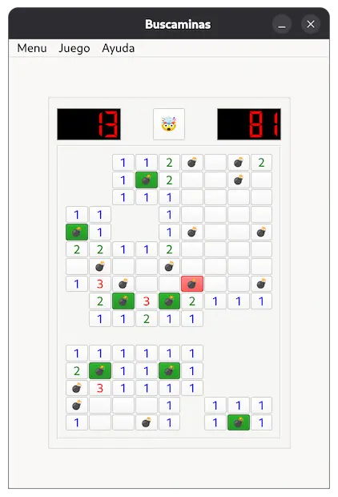
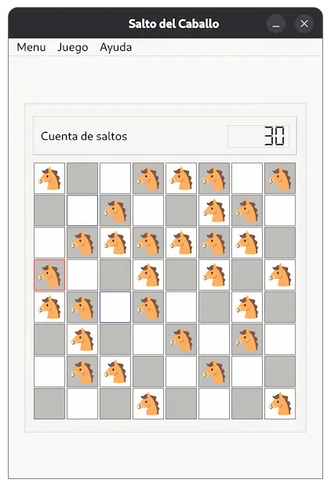
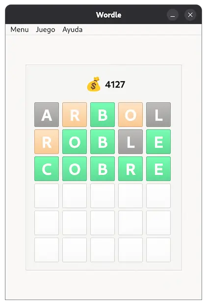

# PyClassicGames


>  **Proyecto final de Desarrollo de interfaces**.<br>Una colección moderna de juegos clásicos de lógica y estrategia, desarrollada en Python con una interfaz gráfica robusta.

---

## Capturas de Pantalla

<p align="center">
  
  
  
  
</p>

## Descripción del Proyecto

**PyClassicGames** es una aplicación de escritorio que unifica tres juegos clásicos bajo una misma interfaz.
El objetivo del proyecto no es solo recrear los juegos, sino implementar una UI que permita al usuario la ejecución de los mismos.

### Los Juegos
1.  **💣 Buscaminas:** El clásico de Windows. Algoritmo de expansión recursiva para abrir celdas vacías y sistema de banderas.
2.  **🐴 El Salto del Caballo:** Desafío de ajedrez matemático. ¿Puedes visitar todas las casillas del tablero sin repetir ninguna?
3.  **🟩 wordle:** Versión del popular juego de adivinar palabras, con lógica de colores y diccionario en español.

---

## Características Técnicas

Con este proyecto demuestro capacidades de desarrollo para software de escritorio:

- [x] **Arquitectura:** Separación lógica entre la interfaz (Vistas), los datos (Modelos) y la lógica de juego (Controladores).
- [x] **Base de Datos:** Sistema persistente que almacena automáticamente las puntuaciones y fecha al finalizar cada partida.
- [x] **Actualizaciones:** Sistema integrado que consulta el repositorio GitHub para verificar si existen nuevas versiones del software.
- [ ] **Informes PDF:** Generación dinámica de reportes de "Salón de la Fama" utilizando la librería **ReportLab**.

---

## Instalación y Uso

Este proyecto ha sido desarrollado en entornos **Linux**, aunque es compatible con Windows y Mac.

### Requisitos Previos
* Python 3.13 o superior.

### Opción A: Instalación Moderna (uv) - Recomendada
Si no dispones de **uv** instalado en tu sistema, puedes ver cómo hacerlo [aquí](https://docs.astral.sh/uv/getting-started/installation/).

1.  **Clonar y sincronizar:**
    ```bash
    git clone https://github.com/TRuHa83/PyClassicGames.git
    cd PyClassicGames
    uv sync
    ```
    *(Esto creará el entorno virtual e instalará todas las dependencias necesarias)*


2. **Ejecutar la aplicación:**
    ```bash
    uv run main.py
    ```

### Opción B: Instalación Tradicional (Pip)
Para entornos que utilizan el método estándar tradicional:

1.  **Crear entorno virtual:**
    ```bash
    python -m venv .venv
    source .venv/bin/activate  # En Linux/Mac
    # .venv\Scripts\activate   # En Windows
    ```

2.  **Instalar dependencias:**
    ```bash
    pip install -r requirements.txt
    ```

3.  **Ejecutar:**
    ```bash
    python main.py
    ```


### Opción Rápida: Ejecutables (Sin instalación)
Si solo quieres jugar sin configurar entornos de desarrollo:

1.  Ve a la sección de **[Releases](https://github.com/TRuHa83/PyClassicGames/releases)** del repositorio.
2.  Descarga el archivo correspondiente a tu sistema operativo.
3.  ¡Ejecuta y juega!

> **Nota:** Estos ejecutables se generan y publican automáticamente mediante **GitHub Actions** cada vez que se lanza una nueva versión, garantizando que siempre descargues la última actualización estable.
---

## Estructura del Proyecto

```text
PyClassicGames/
├── assets/              # Iconos y recursos
├── images/              # Imagenes
│
├── data/                # diccionario
│
├── custom/
│   └── launch.py        # Boton personalizado para lanzar juegos
│
├── games/
│   ├── datagame.py      # Datos de cada juegos
│   ├── knightstour.py   # Lógica salto del caballo
│   ├── minesweeper.py   # Lógica buscaminas
│   └── wordle.py        # Lógica Wordle
│
├── ui/
│   ├── main_window.py    # Vista menu principal
│   ├── score.py          # Vista de puntuaciones
│   └── about_as.py       # Vista de Acerca de...
│
├── modules/
│   ├── config.py        # Módulo de configuración
│   ├── database.py      # Módulo de base de datos
│   └── update.py        # Módulo de actualizaciones
│
├── main.py              # Punto de entrada
├── version.py           # Información de la aplicación
│
├── uv.lock              # Dependencias (uv)
├── pyproject.toml       # Información del proyecto (uv)
│
├── requirements.txt     # Dependencias (pip)
│
├── PyClassicGames.spec  # Ajustes para PyInstaller
│
├── README.md            # Documentación
└── LICENSE              # Licencia del proyecto
```

---

## Roadmap Futuro

Con el avance del proyecto, se plantean las siguientes mejoras y características que podrían resultar interesante añadir o mejorar:

- [ ] **Mejoras en la Interface**: Separar juegos de la UI principal en ventanas independientes para una mejor experiencia de usuario.
- [ ] **Launcher dinámico**: Implementar un sistema de plugins que permita añadir nuevos juegos sin modificar el código base.

